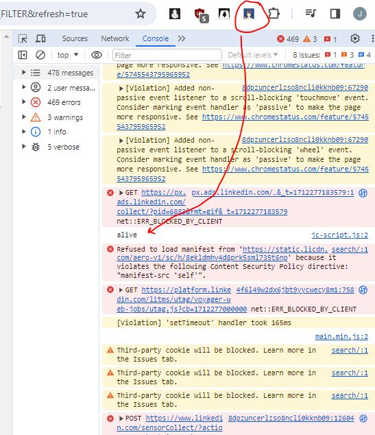

- [ ] fast way to add ignore companies from webpage (inject x button next to company name)
  - guess this means block jobs will use localStorage tied to website
    none of this info is secret so doesn't really matter but it's nice to have secure context it's possible via background.js and an API/db but more work

### 04/04/2024

7:16 PM

Ugh... I'm tired af, Thursdays are the worst days for me. I have to reset my sleep pattern. I'm lucky to sleep 4 hrs on this day usually it's less.

Thankfully my job is labor so I can do it even without much sleep long as I have 5 hr/caffeine.

Bare minimum I'm going to add a code injector part via unpacked chrome extension

It will listen to the scroll down/end event on LinkedIn and then apply the "remove" jobs.

Needs dynamic company list too.

Mostly I need to just start applying again even if the odds are against me these days (I'm nobody).

7:33 PM

Alright code injected, still using manifest 2, briefly tried 3 but immediately there is something wrong lol

Ahh man... I have to remember the communication process between background.js and other context if necessary

7:43 PM

Ugh... eyes hurt, will try again later today while I'm applying.

Should be 2 hours from now or so
