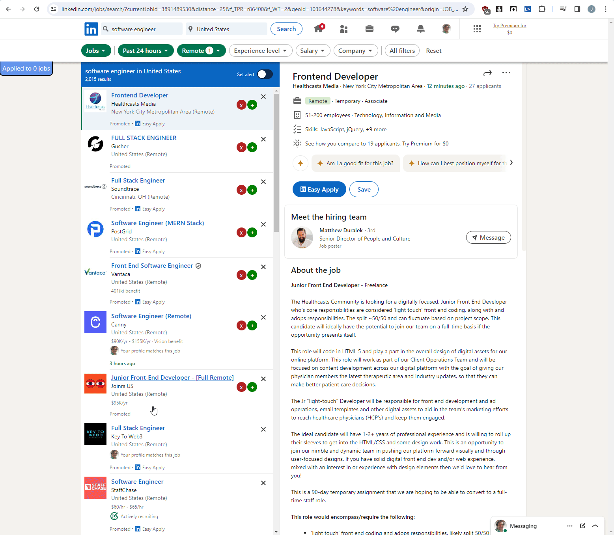
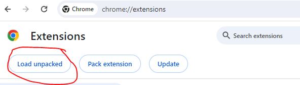

### About

This chrome extension filters LinkedIn jobs further with your own list of blocked companies. The jobs are lazy loaded in and a lot of them are promoted. For me in this case I'm avoiding recruiting/consulting companies and trying to target companies directly.

### How to use

This is loaded as an unpacked extension.

Select the `chrome-extension` folder.

See the `manifest.json` file on what is being used.

- `lijfce.css` styles are injected
- `script-loader.js` adds two scripts:
  - `block.js` (array of known unwanted companies)
  - `lijfce.js` (LinkedIn Job Filter Chrome Extension) this is pretty much "main" where all the code lives

It binds a `scrollend` handler to the job list on the left. Then it removes job nodes based on your filter. The blocked company list grows via a `localStorage` entry as you block more companies. A stats panel is also injected (blue top-left) which can show a counter for jobs you applied to so far.

### Development Note

When you modify files in a loaded extension you have to refresh it in the Chrome Extensions page.

### Manifest v2

I have not updated my extensions to use v3 yet

### Disclaimer

Not affiliated with LinkedIn
