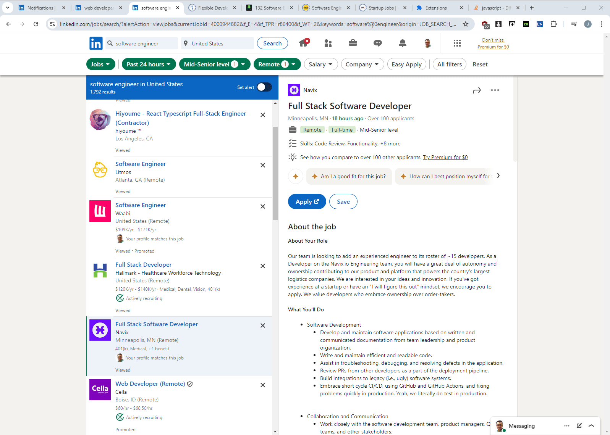

### About

This chrome extension filters LinkedIn jobs further with your own list of blocked companies. The jobs are lazy loaded in and a lot of them are promoted. For me in this case I'm avoiding recruiting/consulting companies and trying to target companies directly.

The gif below shows jobs getting filtered out on the left as you scroll and the job details are checked (red background) for keywords in my case if a degree is required.

### How to use

This is loaded as an unpacked extension.

Select the `chrome-extension` folder.

See the `manifest.json` file on what is being used.

- main.js (most of extension code)
  - filters.js (keywords to filter)
  - events.js (bind to scroll, global click)

It binds a `scrollend` handler to the job list on the left. Then it removes job nodes based on your filter. The blocked company list grows via a `localStorage` entry as you block more companies. A stats panel is also injected (blue top-left) which can show a counter for jobs you applied to so far.

### Popup UI

This communicates with the DOM code to store company names in local storage. This used to be injected into the job search result cards however that started to break the front end due to I believe an XSS measure LinkedIn has.

### Development Notes

When you modify files in a loaded extension you have to refresh it in the Chrome Extensions page and reload the webpage the extension is running on.

### Manifest v2

I have not updated my extensions to use v3 yet

### Disclaimer

Not affiliated with LinkedIn
